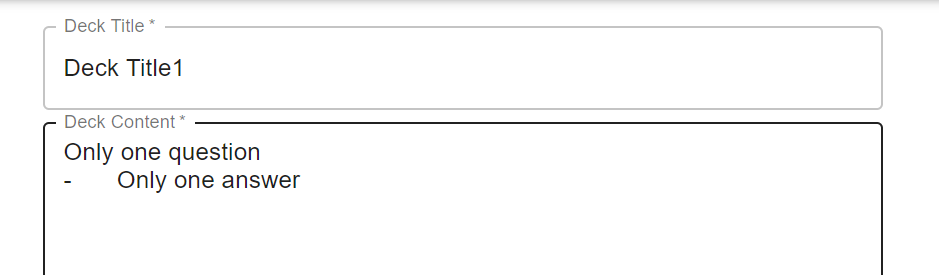
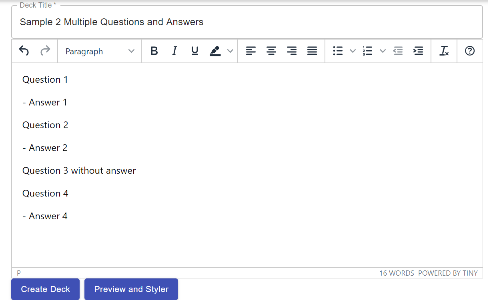
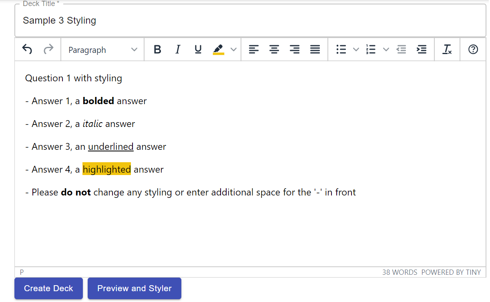
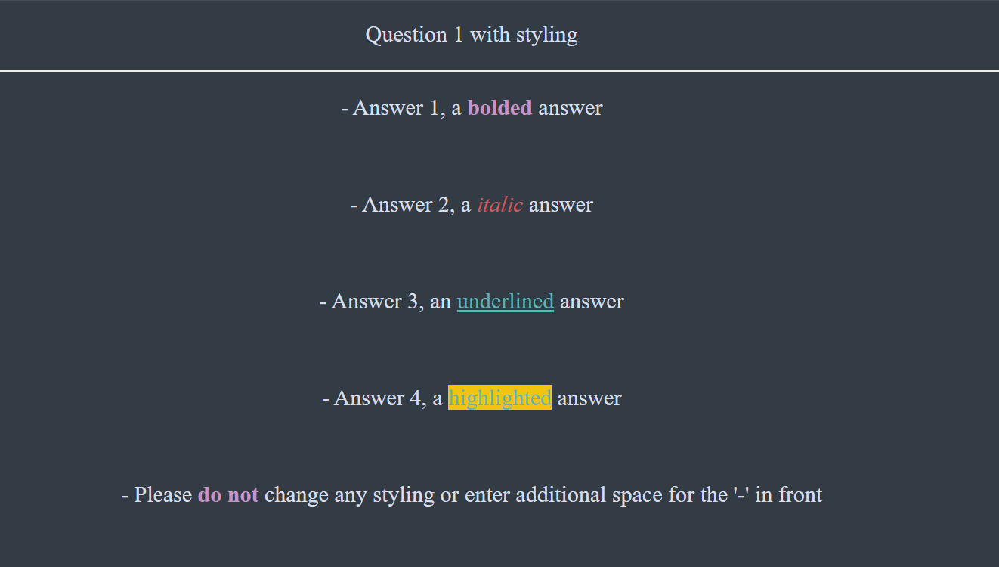

# Python Deck Builder
A full stack web application that automates the creation of Anki decks.

## Tech Stacks
- Database: Firebase
- Backend: Python Flask
- Frontend: ReactJS
  
## How to use?
Currently, **an account** is required to access our service of creating and managing the decks.

### Sign up
1.  If you already have an account, please skip this session and go to [Log in](#log-in)
2. Else, click the ***sign up*** button on the top right
3. On the sign-up page, it is **required to enter all fields**. For password, a **minimum of 6 characters** is needed.
4. Upon successful sign up, you will be redirected to the home page and you can also see your **first name** displayed in the center. 
5. Due to security reasons at this version of the app, please **do not use the same password** that you used for your other online accounts. 

### Log in
1. If you have an account, please click ***log in*** button on the top right.
2. Enter your email and password.
   
### Create Deck
1. Once signed-in, click the ***create deck*** button on the top right.
2. At the create deck page, you can first enter the **title** for your deck. 
3. Then, enter the questions and answers for your flashcard. 
   
   1. Always start with the first line being the question
   2. Then, start **a new line** with **a dash '-'** (without the quotation marks, just a -) and this will be interpreted as your answer to the question
   3. If you have multiple answers, repeat step 2
   4. To move on to the next question, start **a new line being the question** and continue from step 2
   5. Note that you need to follow the suggested format closely
   
   >
   >sample input when there is only one question and answer

   >
   >sample input when there are multiple questions and answers

   >
   >sample input with styling

   >
   >preview of anki card produced from example 3 with style selected as 'dark mode with colour palette' 

4. (***NEW*** Optional) Select your deck style by clicking on the ***preview and styler*** button. 
5. Click the ***Create Deck*** button at the bottom. Upon successful creation, a notification box will pop up and you can choose to go to your profile page or close the notification.
6. For this version, we can mainly support **text-input and simple numerical inputs** (eg. + , - , =). Images and Latex are not supported yet.
7. You can also **bold**, *italic*, <u>underline</u> your content. However, please do not change the styling for the '-' in front of your answer as it will casue bugs in the decks produced.

### (NEW) Preview and Styler
1. At the create deck page, you can now click the ***preview and styler*** button at the bottom
2. There are 3 styles provided for now, do give it a try by clicking on the 'dark mode' or 'dark mode with colour palette' 
   We will add in more interesting styles and freedom for users to customerise their deck styles in the future.
3. Click *SAVE AND CLOSE*

### Profile
1. Once logged in, click the *profile* button on the top right to go to your profile page.
2. In this page, you can download the decks you have created by clicking on the ***download*** button.
3. You can also delete the decks created by clicking on the ***delete*** button. Do note the **action of deletion is irrevocable** so act with caution!

### Log out
1. You can click the ***log out*** button on the top right to log out of your account.

